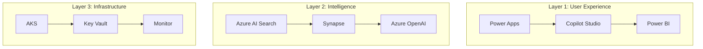

# Claude Code Enhancement Prompt for Azure CoE Repository

## Context

You are enhancing the `azure-enterprise-solutions-architecture` repository, an Azure Center of Excellence that combines the "Three-Layer Enterprise AI Architecture" with Microsoft's CAF, WAF, and Azure Architecture Center guidance.

### Repository Current State
- **Documentation**: Comprehensive README files with ASCII diagrams
- **Assessment Toolkit**: Functional PowerShell extraction scripts
- **Implementation Code**: Nearly absent (67 placeholder directories)
- **Visuals**: ASCII-only, no graphical diagrams
- **Target Audience**: Enterprise architects, but needs better onboarding for less technical stakeholders

---

## Enhancement Objectives

### Objective 1: Fill Critical Implementation Gaps

The repository promises reusable infrastructure-as-code but contains none. Prioritize creating:

#### 1.1 Core Terraform Modules
Location: `infrastructure-as-code/terraform/modules/`

Create these foundational modules:

```
modules/
├── networking/
│   ├── hub-spoke/
│   │   ├── main.tf
│   │   ├── variables.tf
│   │   ├── outputs.tf
│   │   └── README.md
│   └── private-endpoints/
├── security/
│   ├── key-vault/
│   ├── rbac-assignments/
│   └── defender/
├── data/
│   ├── storage-account/
│   ├── synapse-workspace/
│   └── ai-search/
├── compute/
│   ├── aks-cluster/
│   ├── container-apps/
│   └── function-app/
└── monitoring/
    ├── log-analytics/
    └── diagnostic-settings/
```

**Module Requirements**:
- Follow HashiCorp best practices
- Include comprehensive variable validation
- Output all necessary resource IDs and endpoints
- Include usage examples in README
- Support common enterprise patterns (private endpoints, managed identity)

#### 1.2 Bicep Modules
Location: `infrastructure-as-code/bicep/modules/`

Mirror the Terraform modules with Bicep equivalents for Azure-native shops.

#### 1.3 Working Landing Zone Examples
Location: `landing-zones/terraform/enterprise-scale/`

Create a deployable enterprise landing zone example:
- Management group hierarchy
- Hub-spoke network topology
- Policy assignments
- RBAC configuration

---

### Objective 2: Add Visual Architecture Diagrams

The repository needs graphical diagrams for:

1. **Three-Layer Framework Overview**
   - High-quality PNG/SVG showing Layer 1/2/3
   - Show Azure services mapped to each layer
   - Include governance as cross-cutting concern

2. **Landing Zone Architecture**
   - Hub-spoke topology
   - Management group hierarchy
   - Network flow diagram

3. **RAG Architecture**
   - Document ingestion flow
   - Query processing flow
   - Security boundaries

4. **Data Platform Patterns**
   - Medallion architecture (Bronze/Silver/Gold)
   - Real-time streaming pipeline
   - Batch ETL pattern

**Diagram Requirements**:
- Use official Azure architecture icons
- Create in draw.io/diagrams.net format (source files)
- Export to PNG (for README embedding) and SVG (for presentations)
- Store in `diagrams/` directory with clear naming

**Mermaid Alternative**:
Where appropriate, create Mermaid diagrams for simpler visualizations that render directly in GitHub:



---

### Objective 3: Create Layman-Friendly Entry Points

The repository is technically dense. Create accessible entry points:

#### 3.1 Getting Started Guide
Location: `docs/getting-started/`

Create:

**`what-is-this-repo.md`**
- Plain English explanation of purpose
- Who should use it and why
- What problems it solves
- No jargon first page

**`quickstart.md`**
- 5-minute path to first deployment
- Prerequisites checklist
- Single command deployment (if possible)
- Expected results with screenshots

**`glossary.md`**
- Define all acronyms (CAF, WAF, AAC, IaC, etc.)
- Azure service descriptions in plain English
- Link to deeper content

#### 3.2 Persona-Based Guides
Location: `docs/personas/`

**`executives.md`**
- Focus on ROI, business outcomes
- Risk reduction narrative
- Investment justification
- Minimal technical details

**`project-managers.md`**
- Timeline expectations
- Resource requirements
- Dependency mapping
- Risk factors

**`developers.md`**
- Code samples first
- API references
- Quick deployment guides
- Debugging tips

**`architects.md`**
- Design patterns
- Trade-off analysis
- Integration considerations
- Scalability guidance

#### 3.3 Visual Comparison Tables

Enhance existing tables with visual indicators:

```markdown
| Service | Best For | Complexity | Monthly Cost (Est.) | Learning Curve |
|---------|----------|------------|---------------------|----------------|
| Synapse Serverless | Ad-hoc queries | Low | $50-500 | Beginner |
| Synapse Dedicated | Enterprise DW | High | $1,000-10,000+ | Advanced |
| Databricks | ML/Streaming | High | $500-5,000+ | Advanced |
| Fabric | Unified platform | Medium | $400-4,000 | Intermediate |
```

---

### Objective 4: Complete Reference Architectures

Location: `reference-architectures/`

Each subdirectory needs:
1. **README.md** with:
   - Problem statement
   - Solution overview (with diagram)
   - Azure services used
   - When to use / when not to use
   - Cost considerations

2. **Architecture diagram** (PNG + source)

3. **Terraform/Bicep implementation** (working code)

4. **Deployment guide** (step-by-step)

Priority order:
1. `ai-agent-systems/` - Most unique to this framework
2. `data-mesh/` - High enterprise demand
3. `event-driven/` - Common pattern
4. `microservices/` - Foundational
5. `hybrid-cloud/` - Enterprise requirement

---

### Objective 5: Industry-Specific Content

Location: `reference-architectures/industry/`

For each industry, create:

**Healthcare (`healthcare/`):**
- FHIR API integration pattern
- HIPAA compliance checklist
- Healthcare data lake architecture
- Patient engagement solutions

**Financial Services (`financial-services/`):**
- PCI-DSS compliant architecture
- Fraud detection pattern
- Real-time transaction processing
- Regulatory reporting automation

**Retail (`retail/`):**
- E-commerce reference architecture
- Inventory optimization
- Customer 360 pattern
- Demand forecasting

**Manufacturing (`manufacturing/`):**
- IoT telemetry pipeline
- Predictive maintenance
- Digital twin architecture
- Quality analytics

---

### Objective 6: Improve Documentation Infrastructure

#### 6.1 Create Missing Files

**`CONTRIBUTING.md`**
- How to contribute
- Code standards
- PR process
- Issue templates

**`.github/`** directory:
```
.github/
├── ISSUE_TEMPLATE/
│   ├── bug_report.md
│   ├── feature_request.md
│   └── documentation.md
├── PULL_REQUEST_TEMPLATE.md
├── workflows/
│   ├── terraform-validate.yml
│   ├── bicep-validate.yml
│   └── markdown-lint.yml
└── CODEOWNERS
```

#### 6.2 Add Client Deliverable Templates
Location: `assessment-toolkit/client-deliverables/`

Create actual templates (Markdown versions for version control):
- `executive-summary-template.md`
- `assessment-report-template.md`
- `roadmap-template.md`
- `findings-workbook-template.md`

---

### Objective 7: Interactive Elements

#### 7.1 Cost Estimation Helper
Location: `tools/cost-estimator/`

Create a simple HTML/JavaScript tool:
- Input: workload characteristics
- Output: estimated monthly costs
- Links to Azure Pricing Calculator

#### 7.2 Maturity Assessment Visualization
Enhance `assessment-toolkit/analysis-templates/maturity-model.json`:
- Create HTML visualization
- Radar chart display
- Comparison view
- Export to PDF

---

## Implementation Guidelines

### Code Quality Standards

**Terraform:**
- Use Terraform 1.5+ features
- Include `terraform fmt` and `terraform validate` passing
- Add tfsec/checkov annotations where needed
- Version lock all providers

**Bicep:**
- Use Bicep 0.20+ features
- Include bicep linting passing
- Use modules for reusability

**Documentation:**
- Clear headings (H1 for title only)
- Table of contents for long docs
- Code blocks with language hints
- Links to official Microsoft docs

### File Organization

```
azure-enterprise-solutions-architecture/
├── README.md                      # Main entry, keep concise
├── CONTRIBUTING.md                # NEW
├── CHANGELOG.md                   # NEW
├── .github/                       # NEW
├── diagrams/                      # NEW - all visual assets
│   ├── png/
│   ├── svg/
│   ├── drawio/
│   └── mermaid/
├── docs/
│   ├── getting-started/           # NEW - layman entry points
│   ├── personas/                  # NEW - role-based guides
│   ├── architecture/              # POPULATE
│   ├── frameworks/                # POPULATE
│   └── ...
├── infrastructure-as-code/
│   ├── terraform/
│   │   ├── modules/               # POPULATE with reusable modules
│   │   └── examples/              # POPULATE with deployable examples
│   └── bicep/
│       ├── modules/               # POPULATE
│       └── examples/              # POPULATE
├── reference-architectures/       # POPULATE all subdirectories
├── tools/                         # NEW - interactive tools
│   ├── cost-estimator/
│   └── maturity-visualizer/
└── ...
```

---

## Success Criteria

### Completeness
- [ ] Zero `.gitkeep` placeholder files remaining
- [ ] All promised directories contain meaningful content
- [ ] All referenced files actually exist

### Technical Quality
- [ ] Terraform modules pass `terraform validate`
- [ ] Bicep modules pass `az bicep build`
- [ ] All code examples are tested and working

### Visual Engagement
- [ ] At least 10 graphical architecture diagrams
- [ ] Each major section has visual aids
- [ ] Comparison tables use visual indicators

### Accessibility
- [ ] Getting started guide enables first deployment in <30 minutes
- [ ] Glossary covers all acronyms
- [ ] Persona guides exist for 4 key roles

### Documentation
- [ ] CONTRIBUTING.md exists and is comprehensive
- [ ] All README files have table of contents
- [ ] Links to external resources are valid

---

## Execution Approach

### Phase 1: Quick Wins (1-2 days)
1. Create CONTRIBUTING.md
2. Add .github/ templates
3. Create diagrams/ directory structure
4. Add getting-started/ content

### Phase 2: Core Implementation (1 week)
1. Create 5 core Terraform modules
2. Create 5 core Bicep modules
3. Add 5 key architecture diagrams
4. Populate 2 reference architectures

### Phase 3: Depth (2 weeks)
1. Complete all Terraform modules
2. Complete all Bicep modules
3. Complete all reference architectures
4. Add industry-specific content

### Phase 4: Polish (1 week)
1. Interactive tools
2. Video placeholders/links
3. Final documentation review
4. Remove all .gitkeep files

---

## Notes for Claude Code Execution

When working on this repository:

1. **Prioritize working code over documentation** - The gap is in implementation
2. **Use official Azure patterns** - Reference Microsoft's Architecture Center
3. **Include security by default** - Private endpoints, managed identity, encryption
4. **Test before committing** - Validate syntax at minimum
5. **Link related content** - Cross-reference between sections
6. **Maintain the Three-Layer philosophy** - All content should map to the framework

---

*This prompt is designed to be fed to Claude Code for systematic enhancement of the repository.*
