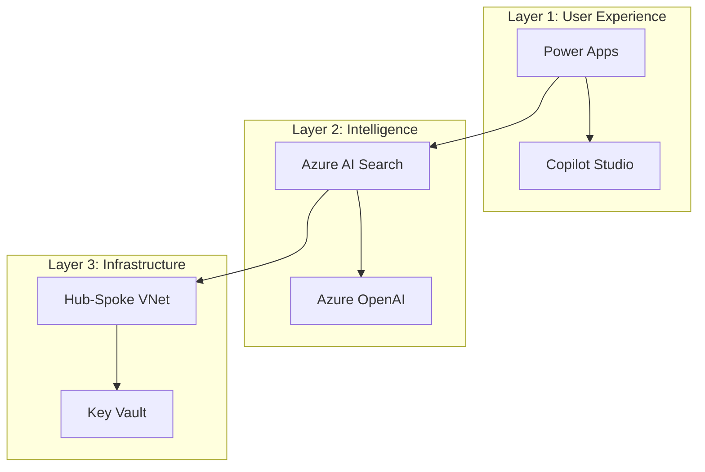

# Azure Enterprise Solutions Architecture - Repository Assessment

> **Note:** This assessment was originally generated in November 2024. Many gaps identified have since been addressed. See "Current Status" sections for updates.

## Executive Summary

This repository serves as an **Azure Center of Excellence (CoE)** for enterprise architects, combining the innovative "Three-Layer Enterprise AI Architecture" framework with Microsoft's official guidance (CAF, WAF, AAC).

| Dimension | Original Score | Current Score | Status |
|-----------|----------------|---------------|--------|
| **Conceptual Framework** | 9/10 | 9/10 | Excellent - unique value proposition |
| **Documentation Quality** | 8/10 | 9/10 | Strong with comprehensive templates |
| **Implementation Artifacts** | 3/10 | 7/10 | IaC modules + assessment toolkit |
| **Visual Engagement** | 4/10 | 4/10 | ASCII diagrams (improvement needed) |
| **Layman Accessibility** | 5/10 | 6/10 | Technical focus, needs entry points |

---

## Part 1: Strategic Assessment

### Strengths

#### 1. Unique Framework Integration
The "Three-Layer Enterprise AI Architecture" provides genuine differentiation:
- **Layer 3 First** (Infrastructure): Build foundation in 90 days, 30-50% cost savings
- **Layer 2 Second** (Intelligence): Data platform in 6-9 months, 2-4x ROI
- **Layer 1 Last** (UX): User experiences in 6-9 months, 5-10x ROI

This sequencing counters the common industry mistake of building flashy UIs on unstable foundations.

#### 2. Business-Outcome Focus
Strong ROI emphasis with documented results:
- 85% user adoption (vs 20% industry average)
- 300% ROI within 18 months
- £2M+ operational savings documented

#### 3. Assessment Toolkit Quality
The `assessment-toolkit/` contains comprehensive assessment materials:
- PowerShell extraction scripts (inventory, security, cost)
- WAF scorecard with 50+ assessment questions
- Gap analysis templates
- Client deliverable templates (executive summary, report, roadmap)
- Interview guides and methodology documentation

#### 4. Documentation Structure
Comprehensive coverage for:
- SME (1-500 employees)
- Mid-Market (500-5000)
- Enterprise (5000+)

#### 5. Reference Repository Curation
Excellent curation of official Microsoft repositories with star counts and purpose descriptions.

---

## Part 2: Gap Analysis

### Addressed Gaps ✅

| Gap | Original Status | Current Status |
|-----|-----------------|----------------|
| **Architecture Decision Records** | Empty | ✅ 5 ADRs created |
| **IaC Terraform Modules** | Empty | ✅ Hub-spoke networking module |
| **IaC Bicep Modules** | Empty | ✅ Azure OpenAI module |
| **Industry Solutions** | Empty | ✅ Healthcare + Financial Services |
| **Client Deliverables** | Empty | ✅ Templates created |
| **Methodology Docs** | Empty | ✅ Interview guide, checklists |

### Remaining Gaps (To Address)

#### 1. Empty Implementation Directories
Some placeholder directories still need content:

| Directory | Expected Content | Priority |
|-----------|------------------|----------|
| `reference-architectures/ai-agent-systems/` | Multi-agent patterns | High |
| `reference-architectures/data-mesh/` | Data mesh implementation | Medium |
| `landing-zones/terraform/enterprise-scale/` | Full landing zone example | High |
| `industry-solutions/retail/` | Retail patterns | Medium |
| `industry-solutions/manufacturing/` | IoT/Industry 4.0 | Medium |

#### 2. Missing Files
- `CONTRIBUTING.md` - Contributor guidelines
- `.github/workflows/` - CI/CD templates
- `.github/ISSUE_TEMPLATE/` - Issue templates
- `.github/pull_request_template.md` - PR template

#### 3. Visual Engagement
Current ASCII-only diagrams need graphical supplements:
- Three-layer architecture diagram (PNG/SVG)
- Landing zone topology
- RAG architecture diagram
- Network flow diagrams

#### 4. Layman-Friendly Entry Points
Need:
- `docs/getting-started/` - Quick start guides
- `docs/glossary.md` - Jargon decoder
- Persona-based guides (executives, developers, architects)

---

## Part 3: Visual Enhancement Recommendations

### Create Diagrams Directory

```
diagrams/
├── png/                          # Static images for README embedding
│   ├── three-layer-overview.png
│   ├── landing-zone-topology.png
│   ├── rag-architecture.png
│   └── zero-trust-network.png
├── svg/                          # Scalable vectors for presentations
├── drawio/                       # Source files (draw.io/diagrams.net)
└── mermaid/                      # Mermaid markdown diagrams
```

**Tool Recommendations:**
- **Draw.io/Diagrams.net** - Free, Azure icon packs available
- **Mermaid** - Markdown-embeddable, version-controllable
- **Azure Architecture Icons** - Official Microsoft icon set

### Add Mermaid Diagrams

Where appropriate, use Mermaid for GitHub-native rendering:



---

## Part 4: Prioritized Action Plan

### Phase 1: Quick Wins (Immediate)

1. ✅ ~~Create Core Terraform Modules~~ - Done (hub-spoke)
2. ✅ ~~Add ADRs~~ - Done (5 ADRs)
3. ⬜ Create CONTRIBUTING.md
4. ⬜ Add .github/ directory (issue/PR templates)
5. ⬜ Add visual diagrams

### Phase 2: Content Depth (Short-term)

6. ⬜ Complete remaining IaC modules
7. ⬜ Create Getting Started Guide
8. ⬜ Add more industry solutions (Retail, Manufacturing)
9. ⬜ Populate reference architectures

### Phase 3: Polish (Medium-term)

10. ⬜ Interactive documentation site (GitHub Pages)
11. ⬜ Video content links
12. ⬜ Community templates
13. ⬜ More case studies

---

## Conclusion

This repository has **exceptional conceptual value** with its unique Three-Layer Framework and business-outcome focus. Significant progress has been made:

- ✅ Assessment toolkit fully implemented
- ✅ Architecture Decision Records documented
- ✅ IaC modules started (Terraform + Bicep)
- ✅ Industry solutions (Healthcare, Financial Services)
- ✅ Client deliverable templates

**Remaining focus areas:**
1. Visual diagrams for engagement
2. Getting started documentation
3. GitHub community templates
4. Additional IaC modules and reference architectures

---

*Original Assessment: November 2024*
*Last Updated: November 2024*
*Repository: azure-enterprise-solutions-architecture*
